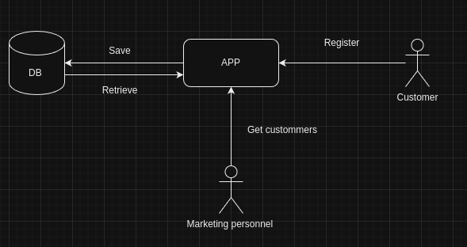

* Customers: (Separation Professionel or not)
   - Register online (email, fullName)
   - Able to input postal adress for delivery
   - Able to input facuration adress for professional Customer

* Marketing Personnal:
   - Get Customer that have still make no purchase (using customer email or telephone)

* Delivery :
   - Possible in local post office or client adress

* Architecture model:  

* Entities:

* Recommendation to use Schema.org (google visibility) if REST API is chosen as a solution
    
